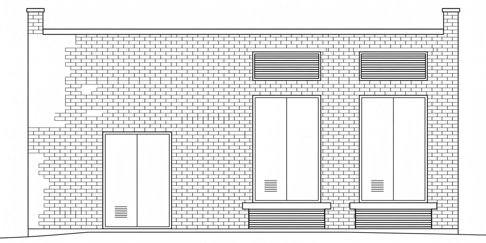

# Ч

Фирменный стиль и дизайн-система галереи искусства и слушания.

**Один человек. Один час. Один объект.**



**Живая версия:** `https://<ваш-логин>.github.io/gallery-ch/` — появится после включения GitHub Pages, см. [ниже](#как-включить-живую-ссылку).

---

## Идея

Знак — это план зала, увиденный сверху. Черта — стена и объект на ней. Точка — человек напротив. По другую сторону черты пусто: человек наедине с искусством.

Имя — одна буква: **час**, **человек**, **черта**.

## Знак

<picture>
  <source media="(prefers-color-scheme: dark)" srcset="assets/mark-horizontal-white.svg">
  
</picture>

Знак живёт в поле `2u × 1u`. Черта стоит на оси симметрии поля и делит его пополам, точка — в центре второй половины, первая остаётся пустой всегда.

| Параметр | Значение |
|---|---|
| Поле | `2u × 1u` (или `1u × 2u`) |
| Длина черты | `0.7u`, концы прямые |
| Толщина черты | `u/10` |
| Диаметр точки | `0.3u` |
| Дистанция черта → точка | `0.5u`, не меняется никогда |
| Охранное поле | `0.5u` |
| Минимум | 32 px на экране, 10 мм в печати |

Толщина черты выведена, а не подобрана: при длине `0.7u` её площадь совпадает с площадью точки с точностью до процента. Стена и человек весят одинаково.

Версий две — горизонтальная (основная) и вертикальная для узких форматов. Поворачивается поле, а не знак.

## Цвет

| | HEX | Роль | Доля |
|---|---|---|---|
| Стена | `#FFFFFF` | фон, тишина | 90% |
| Точка | `#000000` | знак, текст | 9% |
| Час | `#A78353` | акцент | 1% |

В тёмной теме: `#101010` / `#F2F0EC` / `#C9A16A`. Это не «ночной режим», а второе состояние зала — свет выключен, остались объект и человек.

## Типографика

Helvetica Neue, одно семейство. **Light 300** — рабочее начертание. UltraLight 100 только для вордмарка от 120 px, Regular 400 для меток, Medium 500 для выделения. Bold, Black, Condensed и наклонные не используются.

Моноширинного начертания в семействе нет, и оно не нужно: цифры Helvetica табличные по построению — время и таблицы набираются тем же Light с `font-variant-numeric: tabular-nums`.

---

## Что в репозитории

```
index.html                        полная дизайн-система, один самодостаточный файл
tokens/tokens.css                 токены для веба
tokens/tokens.json                токены для Figma Tokens / Style Dictionary
assets/mark-horizontal.svg        знак, горизонтальная версия
assets/mark-vertical.svg          знак, вертикальная версия
assets/mark-*-white.svg           те же в инверсии
assets/facade.jpg                 исходный чертёж фасада
assets/facade-2x1.png             чертёж, скадрированный в поле знака 2:1
```

`index.html` не тянет ни одного внешнего файла: стили, скрипт и чертёж встроены внутрь. Его можно открыть двойным кликом, отправить письмом или положить на любой хостинг.

## Как открыть локально

```bash
open index.html
```

## Как включить живую ссылку

1. **Settings** → **Pages**
2. **Source**: `Deploy from a branch`
3. **Branch**: `main`, папка `/ (root)` → **Save**

Через минуту страница откроется по адресу `https://<ваш-логин>.github.io/gallery-ch/`. Впишите его в начало этого README вместо заглушки.

## Как обновить

Дизайн-система — один файл. Правьте `index.html` и коммитьте:

```bash
git add -A && git commit -m "Правки в раздел «Знак»" && git push
```

Если меняете токены — правьте их и в `index.html` (раздел «Токены»), и в `tokens/`, чтобы документация не разошлась с файлами.

---

## Права

Чертёж фасада, знак, тексты и дизайн-система принадлежат авторам проекта. Лицензия не выбрана — по умолчанию это значит, что использовать материалы без явного разрешения нельзя.
